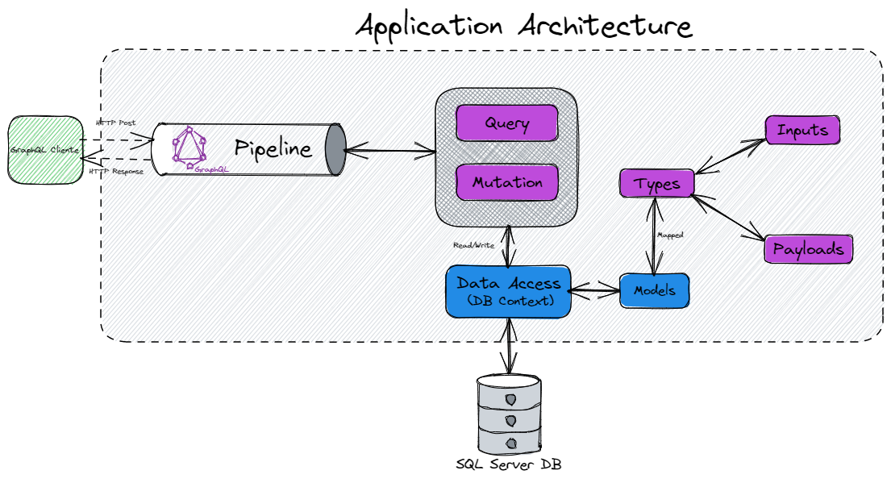

# Platform Registration GraphQL

## System Functionalities 
This is a small API applying GraphQL only focus in an education purpose. The main functionality is registration any software or service that has a command line interface.

## Tool used
- C#
- .Net 6.
- GraphQL.
- HotChocolate.
- EntityFramework.
- SQL Server.
- GraphQL Voyager.
- Docker.

## Start up
1. Clone repository.
2. Install dotnet SDK.
3. Install dotnet-ef.
4. Install Docker.
5. Run compose with the command `docker-compose up -d` on the project directory.
6. Run EF migrations with the command `dotnet-ef database update`.
7. Run the App with the command `dotnet run`.
----
